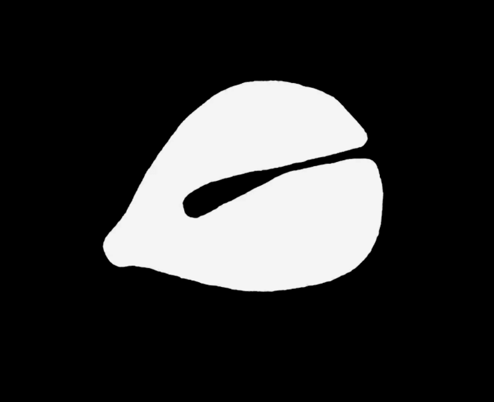
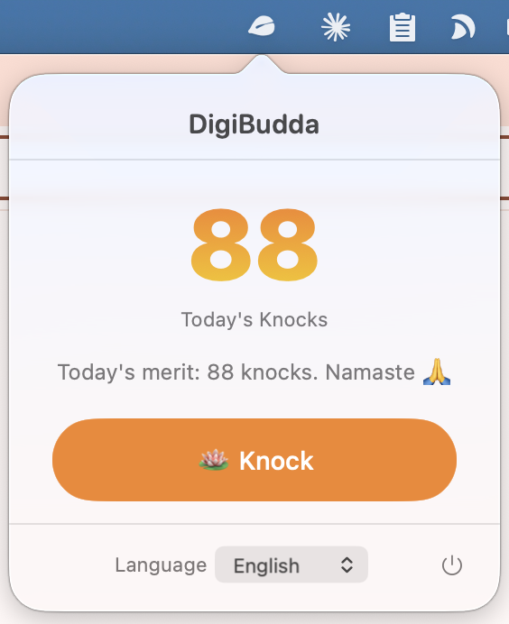

# DigiBudda 🪷 赛博木鱼

<p align="center">
  
</p>

A lightweight, funny macOS menu bar productivity/spiritual parody app.

Click the wooden fish icon in the menu bar to knock. Each knock plays a real wooden fish sound and accumulates today's merit. Supports 6 languages with in-app switching.

<p align="center">
  
  &nbsp;&nbsp;
  
</p>

---

## Features

- **Menu bar only** — lives in the top bar, no Dock icon
- **Wooden fish sound** on every knock
- **Daily counter** — persists across restarts, auto-resets each day
- **Funny merit messages** in 6 languages
- **Language picker** — Follow System / 简体中文 / 繁體中文 / English / 日本語 / 한국어
- **Right-click menu** — About dialog with version info and GitHub link
- **Lightweight** — pure Swift + SwiftUI, no third-party dependencies

---

## Quick Start

No Xcode required. Just a terminal and macOS Command Line Tools.

### 1. Install Command Line Tools (if you don't have them)

```bash
xcode-select --install
```

### 2. Clone and Build

```bash
git clone https://github.com/too-young-too-naive/DigiBudda.git
cd DigiBudda
./build.sh run
```

That's it. The build script will:
- Compile all Swift source files
- Assemble a proper `.app` bundle
- Launch the app

A wooden fish icon will appear in your menu bar.

### 3. Install to Applications (optional)

```bash
./build.sh install
```

Copies the app to `/Applications/DigiBudda.app` so you can launch it from Spotlight.

---

## Build Commands

| Command | What it does |
|---|---|
| `./build.sh` | Build only |
| `./build.sh run` | Build and launch |
| `./build.sh install` | Build and copy to `/Applications` |
| `./build.sh clean` | Remove build artifacts |

---

## Usage

- **Left-click** the wooden fish icon to open the popover
- **Knock** via the button in the popover
- **Switch language** in the popover dropdown
- **Right-click** the icon for About and Quit
- Count **persists** across app restarts and **resets at midnight**

---

## Customization

### Add a New Language

1. Add a case to `AppLanguage` enum
2. Add display name and system locale resolution logic
3. Add strings in `L10n` and `MessageGenerator`

### Replace the Sound

Drop a `woodenfish.mp3` (or `.wav` / `.m4a`) into `DigiBudda/Resources/` and rebuild.

---

## Requirements

- macOS 14.0+
- Swift 5.9+ (included with Command Line Tools)

---

## License

MIT — knock freely, accumulate merit infinitely.
